# UEBuffSystem

Simple system of Buffs (effects that affect game entities). The system allows you to build complex chains of buffs and projectiles based on the parameters of effects and carriers. For information on how to use this system, see the "how to use" section.


# Content

1. [Technical task](#technical-task)
1. [Idea](#idea)
1. [Implementation](#implementation)
    * [Step 1: Demo characters](#step-1-demo-characters)
    * [Step 2: Base classe](#step-2-base-classes)
    * [Step 3: Parameters and parameter chains](#step-3-parameters-and-parameter-chains)
1. [How to use](#how-to-use)
	1. [Projectile carrier](#prjectile-carrier)
		* [Step 1: Create child blueprint from ABuffDebuffProjectileBase class](#step-1-create-child-blueprint-from-abuffdebuffprojectilebase-class)
		* [Step 2: Customize the visual display for each carrier](#step-2-customize-the-visual-display-for-each-carrier)
		* [Step 3: Create a Data Asset for the Parameter Chain and configure it](#step-3-create-a-data-asset-for-the-parameter-chain-and-configure-it)
		* [Step 4: Link your emitter (Gun in the demo) and your DataAsset](#step-4-link-your-emitter-gun-in-the-demo-and-your-dataasset)
	1. [Pickup carrier](#pickup-carrier)
		* [Step 1: Create child blueprint from ABuffDebuffPickupBase class](#step-1-create-child-blueprint-from-abuffdebuffpickupbase-class)
		* [Step 2: Customize the visual display for each pickup object](#step-2-customize-the-visual-display-for-each-pickup-object)
		* [Step 3: Configure Parameter Chain in panel "Details"](#step-3-configure-parameter-chain-in-panel-details)
	1. [Result of the use case](#result-of-the-use-case)

# Technical task

The original text of the technical task (```It is desirable to implement on UE4```):

```
Техническое задание

Реализовать систему Баффов (эффекты, влияющие на игровые сущности). Реализовать именно новую систему, а не использовать Gameplay Ability System.

На сцене присутствует персонаж игрока и другие персонажи. У них есть параметры - Жизни, Скорость перемещения. Неигровые персонажи перемещаются линейно в случайном направлении по сцене с заданной скоростью перемещения.
Персонаж игрока имеет 3 оружия. Стрельба из них происходит по нажатию кнопок 1, 2, 3. Оружие выстреливает пулей и при коллизии воздействует на всех в определенном радиусе. 
Каждое оружие накладывает определенный бафф на цели в радиусе - Мгновенное снижение жизней, Снижение жизней за определенный промежуток времени, снижение скорости перемещения на определенное время. Параметры Баффов настраиваются из таблицы DataTable.
При достижении 0 жизней персонаж умирает.
Пока бафф висит на персонаже, опционально: на нем проигрывается соответствующий эффект.

Опционально: индикация повреждений/оставшегося здоровья с помощью виджета над персонажами. Текущие Баффы персонажей. Достаточно текстовой информации

Важна реализация и структура классов, ресурсы для отображения эффектов из любых источников. Визуальная составляющая не имеет значения, главное соответствие ТЗ.

```

# Idea

The idea of the implementation is to create a flexible system for setting up buffs and their carriers. To do this, it is necessary to highlight the basic concepts:

**Carrier** - is an actor on the stage that carries some set of effects. The carrier can be activated in many ways - it can be a projectile (like a bullet) that carries a buff/debuff effect (like a health reduction effect on hit).

**Effect** - applicable to some game entity, which means it is logical to implement it as an ActorComponent. The effect can also be of different types - it can affect health, or speed, or somthing else.

*Options*. Each **carrier** and each **effect** must have its own parameters. For example, a "carrier" in the form of a projectile should have **CarrierParams**:
* projectile collision **radius**;
* the **initial speed** of the projectile;
* **lifetime**, so that the projectile is destroyed after a certain time.

The **EffectParams** may be different for each effect type. The common parameters for all effects are the following:
* the **name** of the effect;
* Whether the effect **is cancelable** (does it cancel its impact);
* The **duration** of the effect;
* It affects at a time or has an effect **cyclically**;
* If the effect is cyclic, then it is necessary to be able to set the **cycle interval**.

**Now let's add the idea that each "carrier" and each "effect" can spawn child "carriers" and "effects" upon completion**. This is a very important point in order to be able to configure complex transport and effect chains. Let's look at the idea in more detail.


The picture above shows an example of a **chain of carriers and buffs** (or **BuffSystemChain** for short). the picture shows an example of a simple chain: `Projectile -> Explosion -> Damage Effect`. 

In this case, the chain can be much more complicated, where each "carrier" can carry several child carriers, each of which, in turn, can carry several effects. An example of such a system is shown in the following picture:


A complicated chain of the buff system - it can be set simply by a set of parameters, and for the visual design of the individual elements of the "carrier" and "effect" will be the class objects that spawn into the world at the moment the parent carrier is activated.

The idea seems to be clear. Let's do it.


# Implementation

I think the best way to start the task is with the architecture of the future application. To do this, we will separate part of the implementation of the Buff System itself and the game code. Let's create a `UEBuffSystem` plugin, in which we will implement a set of classes and data, and the code of the game itself will store the implementation of connecting this plugin to the game in order to demonstrate its performance. Accordingly, we distinguish two main modules:
* `UEBuffSystemDemo` - the main module of the game (demo application)
* `UEBuffSystem` - a module wrapped in a plug-in, which can later be reused in other projects.


## Step 1: Demo characters

In the main game module, let's create a simple enemy class. We will use it to test and demonstrate buff effects. The model will be used as a standard manikin. We will create the following characteristics for the character class:

* base movement speed;
* scale character;
* character's health;
* character color.

```C++
USTRUCT(BlueprintType)
struct FEnemyCharacteristics
{
	GENERATED_BODY()
	
	UPROPERTY(EditAnywhere, BlueprintReadWrite, Category="Enemy Characteristics")
	float BaseMovementSpeed = 600.f;

	UPROPERTY(EditAnywhere, BlueprintReadWrite, Category="Enemy Characteristics")
	float Health = 1000.f;

	UPROPERTY(EditAnywhere, BlueprintReadWrite, Category="Enemy Characteristics")
	FLinearColor Color = FLinearColor::Red;

	UPROPERTY(EditAnywhere, BlueprintReadWrite, Category="Enemy Characteristics")
	float ScaleMultiplier = 1.f;
};
```

This is enough to demonstrate. 

Randomize these parameters for spawning enemies and teach them how to walk. As stated in the terms of reference, let them go only forward, and when they meet an obstacle, let them change direction to random.

We will make our character indestructible for the demonstration, but we will give him the opportunity to change guns.

```C++
	/** Fires a projectile. */
	void OnFire();

	void OnChangeGun1() { OnChangeGun(EGunType::INSTANT_LIFE_REDUCTION); };
	void OnChangeGun2() { OnChangeGun(EGunType::GRADUAL_DECLINE_LIFE); };
	void OnChangeGun3() { OnChangeGun(EGunType::SPEED_REDUCTION); };
	void OnChangeGun4() { OnChangeGun(EGunType::GRENADE); };
	void OnChangeGun5() { OnChangeGun(EGunType::ELECTRO_GRENADE); };
	void OnChangeGun(EGunType InGunType);
```

Let there be five types of weapons to showcase the various "buff carriers". You can change weapons to the following keys:
* key `1` - shoots regular bullets that deal damage once;
* key `2` - shoots "poisonous" bullets, which for some time reduce the lives of enemies;
* key `3`- let there be bullets that do little damage and slow down the enemy;
* key `4` - let there be grenades that, after touching the enemy, cause an explosion, which causes damage to everyone within its radius of action;
* key `5` - let there be an "electric grenade", which, after touching, explodes and leaves behind an electrified area for a while, entering which the enemy receives periodic damage.

In order for our enemies and our character to be subject to buffs, while not applying buffs to any game entities, we need to implement an interface `Plugins/UEBuffSystem/Source/UEBuffSystem/Public/Interfaces/IBuffReceiver.h` in the enemy class and character class:

```C++
class UEBUFFSYSTEM_API IBuffReceiver
{
	GENERATED_BODY()

public:	
	/** Called for change health */
	UFUNCTION(BlueprintCallable, BlueprintNativeEvent)
	void AddHealth(float AddHealthValue);
	virtual void AddHealth_Implementation(float AddHealthValue) {};
	
	/** Called for change speed */
	UFUNCTION(BlueprintCallable, BlueprintNativeEvent)
	void AddSpeed(float AddSpeedValue);
	virtual void AddSpeed_Implementation(float AddSpeedValue) {};
};
```

Approximately it will look like this:

```C++
UCLASS(config=Game)
class UEBUFFSYSTEMDEMO_API AEnemy : public ACharacter, public IBuffReceiver
{
    // ...
    /** IBuffReceiver interface start */	
	virtual void AddHealth_Implementation(float AddHealthValue) override;
	virtual void AddSpeed_Implementation(float AddSpeedValue) override;	
	/** IBuffReceiver interface end */
    // ...
}
```

```C++
UCLASS(config=Game)
class AUEBuffSystemDemoCharacter : public ACharacter, public IBuffReceiver
{
    // ...
    /** IBuffReceiver interface start */	
	virtual void AddHealth_Implementation(float AddHealthValue) override;
	virtual void AddSpeed_Implementation(float AddSpeedValue) override;	
	/** IBuffReceiver interface end */
    // ...
}
```

> IMPORTANT: Only those game entities that implement this interface will be affected by Buffs/Debuffs

## Step 2: Base classes

For simplicity and speed of implementation, let's create base classes that will be implemented as `Actors` for `Carrier` and `ActorComponent` for `Effect`. Let the base class hierarchy look something like this:

```
* Carriers
    * BuffDebuffCarrierBase (AActor)

* Effects
    * BuffDebuffEffectBase (UActorComponent)
```

`BuffDebuffCarrierBase` - an entity in the world that will carry the buff or debuff effect. It can be a pickup in the world, or as indicated in the task, it can be a projectile bullet.

`BuffDebuffEffectBase` - an abstract entity, in the life cycle of which the impact on characteristics will be carried out. When the "death" of the object - the effect will be removed.

For simplicity, we divide carriers into two types:
* `BuffDebuffPickupBase` - the carrier will be activated from the events of `OnBeginOverlap`;
* `BuffDebuffProjectileBase` - will be activated from a `OnHit`.

For simplicity, we divide the effects into two types:
* `BuffDebuffHealth` - the effect will affect health;
* `BuffDebuffSpeed` - the effect will affect the speed.

Now the base class hierarchy looks like this:

```
* Carriers
    * BuffDebuffCarrierBase (AActor)
        * BuffDebuffPickupBase (BuffDebuffCarrierBase)
        * BuffDebuffProjectileBase (BuffDebuffCarrierBase)

* Effects
    * BuffDebuffEffectBase (UActorComponent)
        * BuffDebuffHealth (BuffDebuffEffectBase)
        * BuffDebuffSpeed (BuffDebuffEffectBase)
```

When the logical entities "Carrier" and "Effect" are created, it is worth thinking about simplifying the setting of their parameters.

## Step 3: Parameters and parameter chains 

The logical entity "CarrierBase", as described in the [Idea](#idea) section, should be set with the following parameters:

```C++
/*
 * Base Carrier Params class
 */
UCLASS(BlueprintType, Abstract)
class UEBUFFSYSTEM_API UBuffDebuffCarrierParamsBase : public UObject
{
	GENERATED_BODY()
	
public:
	UPROPERTY(EditAnywhere, BlueprintReadWrite, Category="Spawning class")
	TSubclassOf<ABuffDebuffCarrierBase> CarrierClass;

	UPROPERTY(EditAnywhere, BlueprintReadWrite, Category="Settings")
	float CollisionRadius;	
	
	UPROPERTY(EditAnywhere, BlueprintReadWrite, Instanced, Category="Next generation")
	TArray<UBuffDebuffCarrierParamsBase *> ChildCarriers;

	UPROPERTY(EditAnywhere, BlueprintReadWrite, Instanced, Category="Next generation")
	TArray<UBuffDebuffEffectParamsBase *> ChildEffects;
};
```

Where:
* `CarrierClass` - a Carrier class with a customized visual part that will be spawned;
* `CollisionRadius` - Activation radius;
* `ChildCarriers`, `ChildEffects` - parameters for the spawn of child carriers and effects when activated.

Now let's expand the list of parameters for the Projecttile and Pickup classes as follows:

```C++
UCLASS(BlueprintType, EditInlineNew)
class UEBUFFSYSTEM_API UBuffDebuffProjectileParams : public UBuffDebuffCarrierParamsBase
{
	GENERATED_BODY()

public:	
	UPROPERTY(EditAnywhere, BlueprintReadWrite, Category="Projectile Settings")
	float Speed = 3000.f;

	UPROPERTY(EditAnywhere, BlueprintReadWrite, Category="Projectile Settings")
	float LifeTime = 3.f;
};
```

```C++
UCLASS(BlueprintType, EditInlineNew)
class UEBUFFSYSTEM_API UBuffDebuffPickupParams : public UBuffDebuffCarrierParamsBase
{
	GENERATED_BODY()

public:
	UPROPERTY(EditAnywhere, BlueprintReadWrite, Category="Pickup Settings")
	bool bIsDestroyAfterOverlap = true;
	
	UPROPERTY(EditAnywhere, BlueprintReadWrite, Category="Pickup Settings")
	float LifeTime = 0.f;
};
```

Effects have a slightly more complex parameter structure, for customization flexibility:

```C++
UCLASS(BlueprintType, Abstract)
class UEBUFFSYSTEM_API UBuffDebuffEffectParamsBase : public UObject
{
	GENERATED_BODY()
	
public:
	UPROPERTY(EditAnywhere, BlueprintReadWrite, Category="Spawning class")
	TSubclassOf<UBuffDebuffEffectBase> EffectClass;

	UPROPERTY(EditAnywhere, BlueprintReadWrite, Category="Effect")
	FName Name;
	
	UPROPERTY(EditAnywhere, BlueprintReadWrite, Category="Effect Settings")
	bool bIsCancelableEffect = false;
	
	UPROPERTY(EditAnywhere, BlueprintReadWrite, Category="Effect Settings")
	float LifeTime = 0.f;
	
	UPROPERTY(EditAnywhere, BlueprintReadWrite, Category="Effect Settings")
	bool bIsCycle = false;
	
	UPROPERTY(EditAnywhere, BlueprintReadWrite, Category="Effect Settings")
	float CycleTime = 0.f;	

	UPROPERTY(EditAnywhere, BlueprintReadWrite, Instanced, Category="Next generation")
	TArray<UBuffDebuffCarrierParamsBase *> ChildCarriers;

	UPROPERTY(EditAnywhere, BlueprintReadWrite, Instanced, Category="Next generation")
	TArray<UBuffDebuffEffectParamsBase *> ChildEffects;
};
```

Accordingly, `BuffDebuffHealth` and `BuffDebuffSpeed` have been extended as follows:

```C++
UCLASS(BlueprintType, EditInlineNew)
class UEBUFFSYSTEM_API UBuffDebuffHealthParams : public UBuffDebuffEffectParamsBase
{
	GENERATED_BODY()

public:	
	UPROPERTY(EditAnywhere, BlueprintReadWrite, Category="Health Effect Settings")
	float AddHealth = -100.f;	
};
```

```C++
UCLASS(BlueprintType, EditInlineNew)
class UEBUFFSYSTEM_API UBuffDebuffSpeedParams : public UBuffDebuffEffectParamsBase
{
	GENERATED_BODY()

public:	
	UPROPERTY(EditAnywhere, BlueprintReadWrite, Category="Speed Effect Settings")
	float AddSpeed = -200.f;	
};
```

**Total:** To set a chain of parameters for carriers and effects, it is enough for us to have:
* a set of classes, for each carrier, that implement its visual part;
* entry point for parameters when spawning the first parent carrier.

Set of classes, for each carrier, are implemented in the demo project in the form of blueprints:


The entry point for passing/binding parameters is a DataTable that contains DataAssets with parameters.
> The DataAsset is configured for the convenience of GameDesigners so that the parameter objects are instantiated objects and filled directly in the DataAsset itself.

Here is an example of a completed and configured Data Asset for the parent transporter - grenade:


# How to use

Using the plugin in a project is quite simple. Game Designers are provided with a tool for creating chains of transporters and buffs, in the form of a Data Asset, and the visual composition of transporters and effects can be easily adjusted in the blueprint in the usual way.

## Prjectile carrier

### Step 1: Create child blueprint from ABuffDebuffProjectileBase class

To create a projectile that carriers buffs or debuffs, you must first create a child blueprint from the `ABuffDebuffProjectileBase` class in order to customize its visual component.

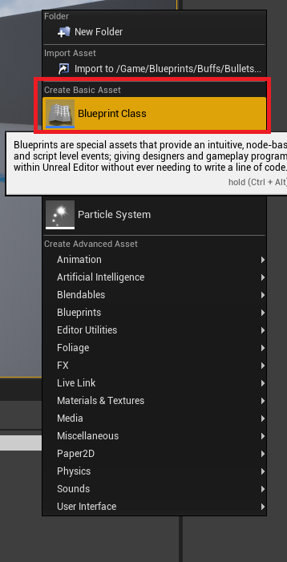


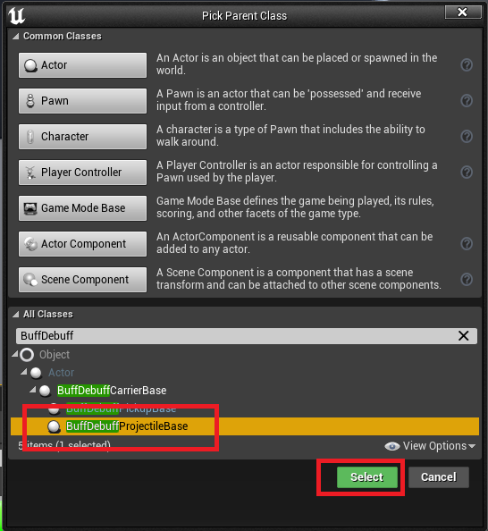

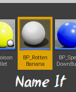

### Step 2: Customize the visual display for each carrier

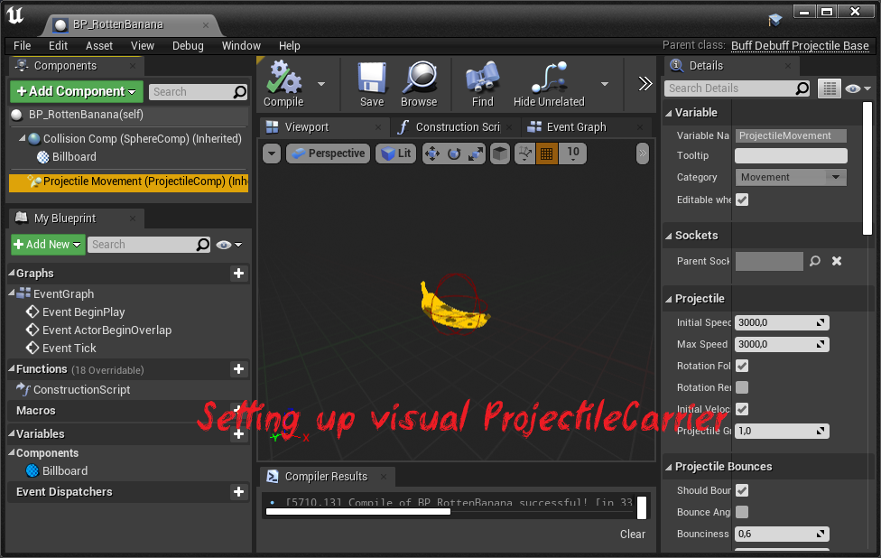

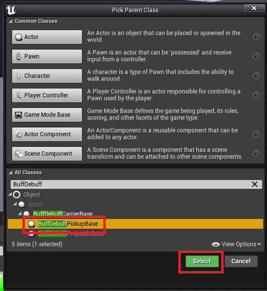

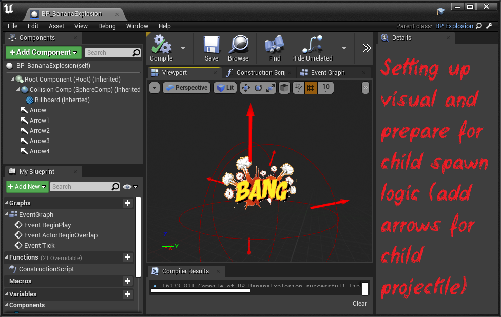

```Bash
> 
> IMPORTANT:
> You can override logic if need
>   
```


### Step 3: Create a Data Asset for the Parameter Chain and configure it

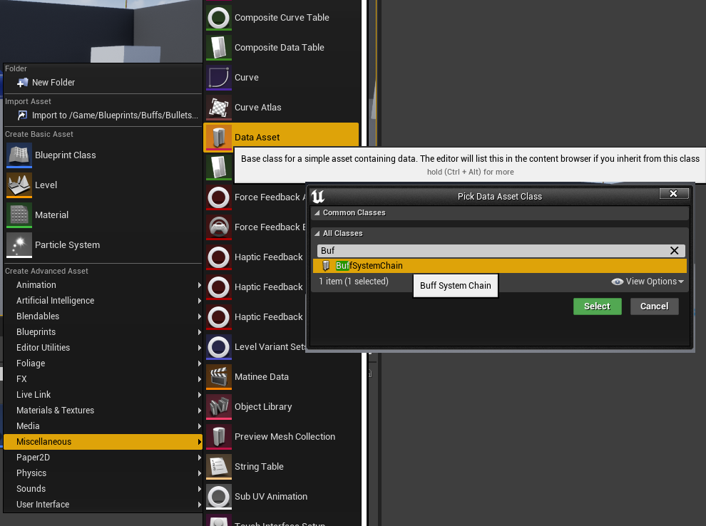

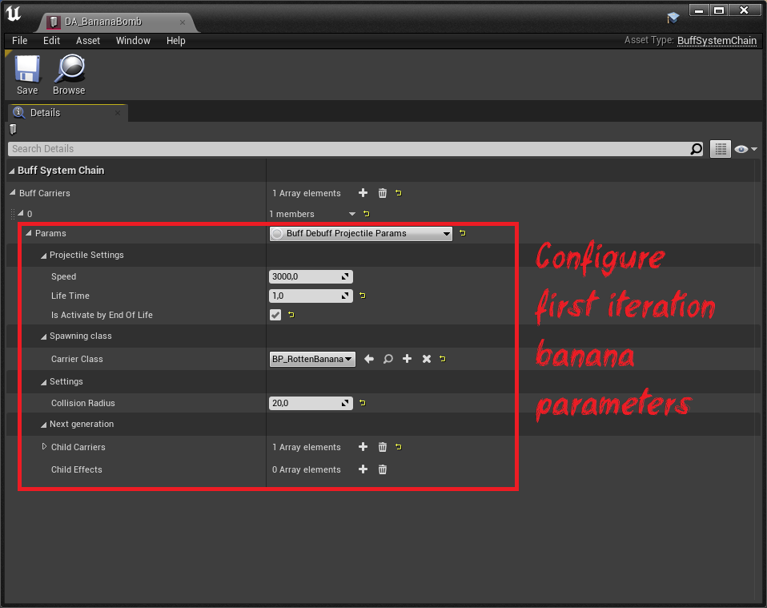

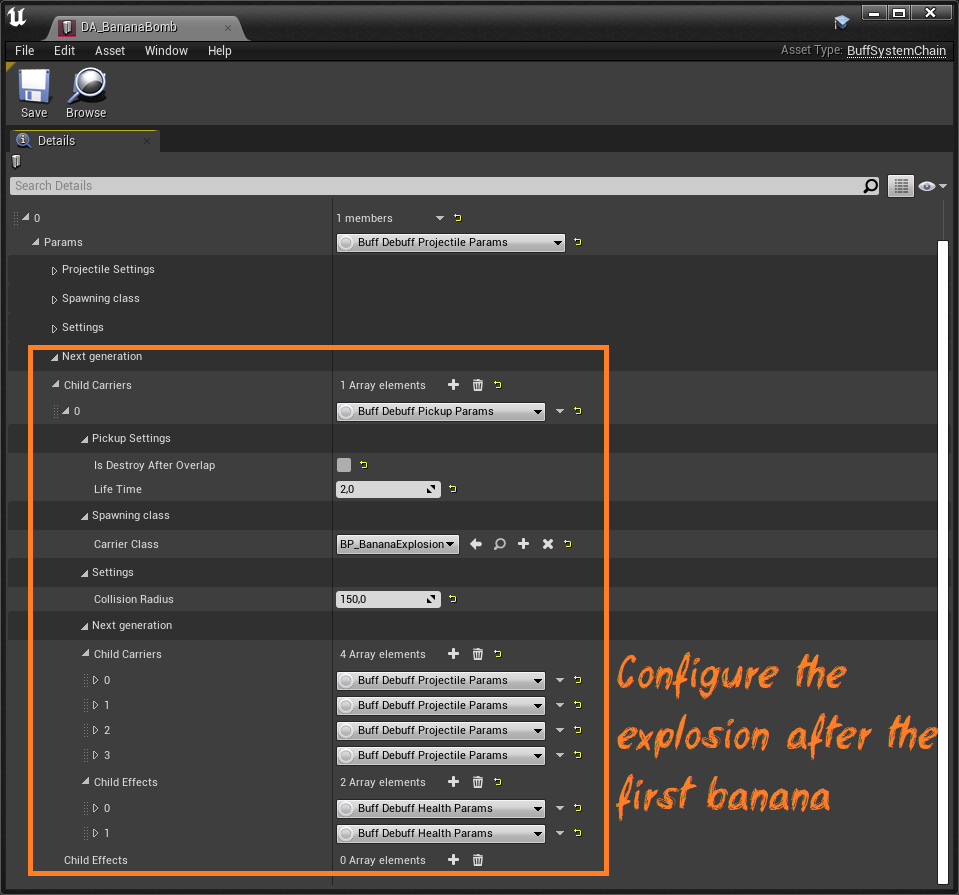

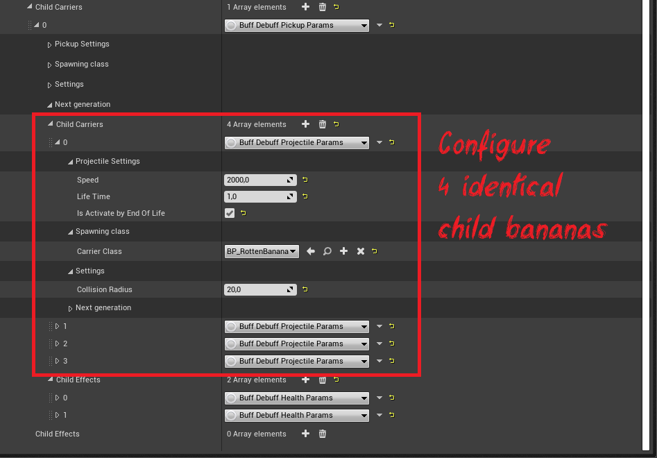


### Step 4: Link your emitter (Gun in the demo) and your DataAsset

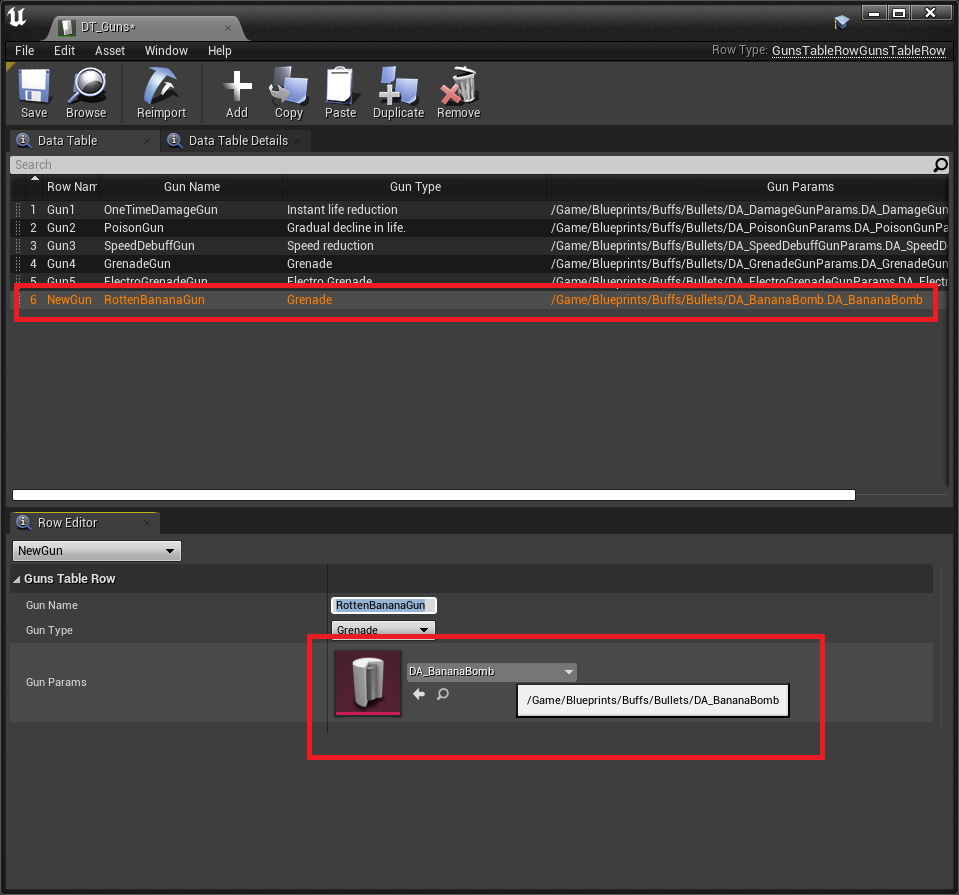

```Bash
>
> IMPORTANT:
> Don't forget to initialize your carrier right after spawning!
>
```

In code:

```C++
if (BuffCarrierParams.Params->CarrierClass != nullptr)
{									
	auto Bullet = World->SpawnActor<ABuffDebuffCarrierBase>(BuffCarrierParams.Params->CarrierClass, SpawnLocation, SpawnRotation, ActorSpawnParams);
	if (Bullet != nullptr)
	{
		Bullet->Init(BuffCarrierParams.Params);
	}
}
```

Or in Blueprint:

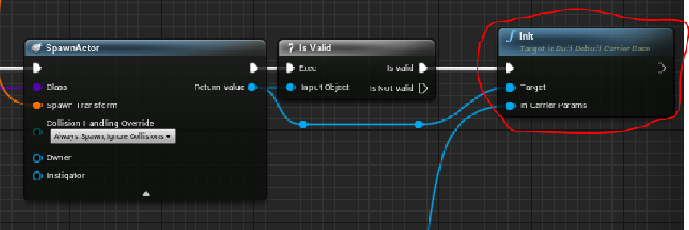

## Pickup carrier

### Step 1: Create child blueprint from ABuffDebuffPickupBase class


### Step 2: Customize the visual display for each pickup object

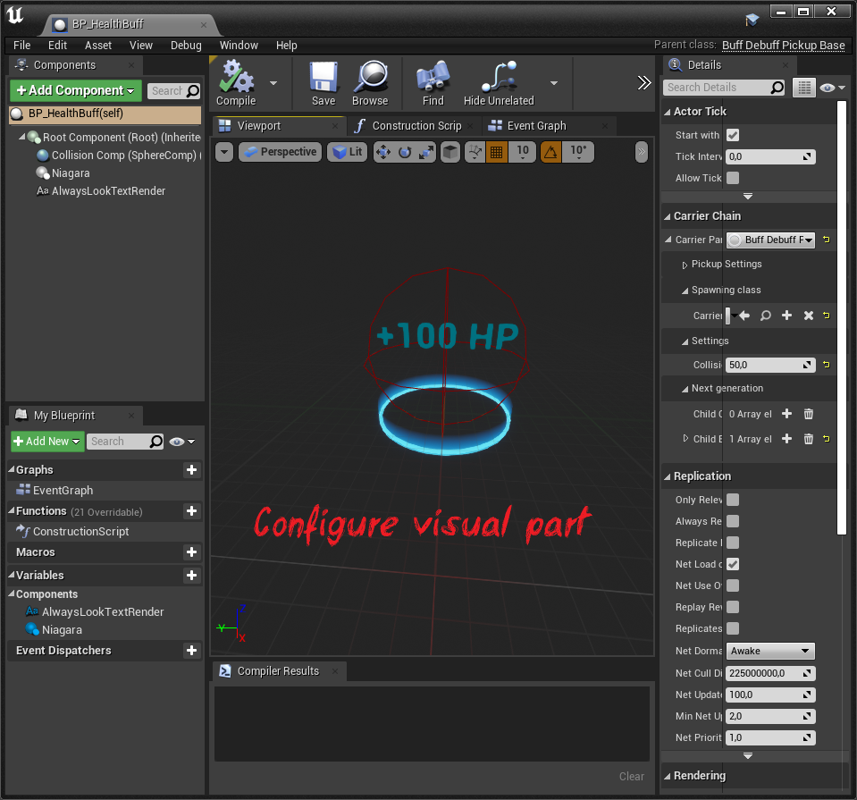

### Step 3: Configure Parameter Chain in panel "Details"

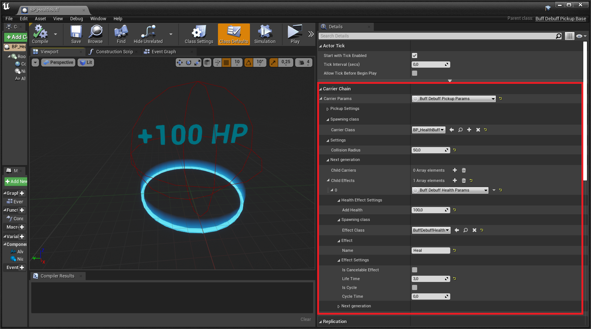

```Bash
>
> IMPORTANT:
> Don't forget to initialize your carrier right after spawning!
>
```

In code:

```C++
if (BuffCarrierParams.Params->CarrierClass != nullptr)
{									
	auto Bullet = World->SpawnActor<ABuffDebuffCarrierBase>(BuffCarrierParams.Params->CarrierClass, SpawnLocation, SpawnRotation, ActorSpawnParams);
	if (Bullet != nullptr)
	{
		Bullet->Init(BuffCarrierParams.Params);
	}
}
```

Or in Blueprint:


## Result of the use case

